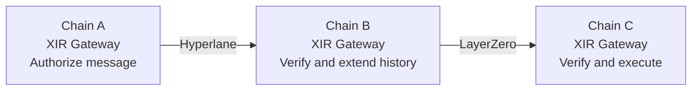

<div align="center">

# XIR

**A Framework for Interoperability across Cross-Chain Protocols<br>Based on a Verifiable Intermediate Representation**

[](https://arxiv.org/abs/2609.20010)
[](https://www.kaggle.com/datasets/yushenlee/xir-cross-chain-events-2025)
[](LICENSE)

Yushen Li · Linpeng Jia · Jiaying Feng · Ziliang Liao · Yi Sun

**Manuscript submitted to _Blockchain: Research and Applications_ (BCRA).**

[Paper](https://arxiv.org/abs/2609.20010) · [Dataset](https://www.kaggle.com/datasets/yushenlee/xir-cross-chain-events-2025) · [Quick start](#quick-start) · [Citation](#citation)

</div>

## Overview

Cross-chain protocols let applications exchange messages between blockchains.
Reusing an existing `A → B` connection and a `B → C` connection requires a
handoff on B, especially when the two connections use different protocols.
XIR provides a common representation that binds an application message to an
ordered record of authenticated protocol deliveries. XIR Gateways and XIR
Adapters carry this record across hops so that the destination can check the
message and its verification history before execution.

This repository contains the XIR research implementation and experiment tools:
Solidity contracts, a Python orchestration runtime, an independent Go runtime
for the execution layer, Bash deployment scripts, versioned configurations, and
selected verification artifacts. The implemented EVM protocol integrations are
**Hyperlane and LayerZero V2**. The accompanying observational dataset covers
six protocols.

## How XIR works



The example switches protocols at B. A same-protocol path uses the same
protocol for both connections.

| Component | Responsibility |
| --- | --- |
| [XIR Gateway](contracts/src/XIRGateway.sol) | Authorize records, check ordered receipts, enforce policy, and prevent duplicate committed delivery at the destination |
| [XIR Registry](contracts/src/XIRRegistry.sol) | Store verification profiles, approved components, and source authorization configuration |
| [Hyperlane Adapter](contracts/src/HyperlaneAdapter.sol) and [LayerZero Adapter](contracts/src/LayerZeroAdapter.sol) | Connect native protocol callbacks and sends to the common representation |
| [Python runtime](src/xir_lab/) | Plan and execute bounded experiments, collect evidence, reconcile outcomes, and build reports |
| [Go runtime](go-runtime/) | Independently implement the execution layer: byte-compatible encoding and signing, durable dispatch and confirmation, and restart recovery. It consumes frozen plans and deployment documents; planning, governance gates, analysis, and publication stay Python-side ([notes](docs/go-runtime.md)) |

The controlled experiments use Besu QBFT chains. Hyperlane's validator and
relayer are upstream Rust components; the local LayerZero deployment combines
its official EVM contracts with a self-hosted Python research worker. See the
[component lock](toolchain/native-protocol-stack.lock.json) and
[native-stack runbook](docs/native-stack-runbook.md) for the exact roles.

## Results reported in the paper

The graph analysis and the prototype experiments provide different kinds of
evidence. The following figures summarize the associated paper.

| Evidence | Result | Scope |
| --- | --- | --- |
| Observed activity | **24,983,410 events**, six protocols, **286 active blockchains** | January–October 2025 mainnet events after identity resolution and deduplication |
| Reachability | **11,935 direct pairs → 78,953 pairs through composition**; **14.64% → 96.86%** | Cumulative observed graph, assuming the required XIR coverage and configured paths |
| Local delivery | **40,000 completed requests** | Controlled Hyperlane/LayerZero stacks; HH, LL, HL, and LH paths |
| Verification checks | **780 adversarial case-runs** | Thirteen classes, two protocol directions, thirty repetitions per class and direction |
| Multi-hop cost | **22,000 executions** across eleven paths | Controlled one-to-four-hop experiments |
| Public testnets | **7 deliveries from 11 attempts** | Selected paths; four attempts encountered protocol failures |

Reachability counts ordered pairs of distinct blockchains: the denominator is
`286 × 285 = 81,510`. The 78,953 reachable pairs include the 11,935 direct pairs,
leaving **67,018 additionally reachable pairs**. Under the paper's direct
configuration model, serving those additional pairs directly requires 67,018
new point-to-point configurations. Configuration counts are separate from
contract deployment counts and measured gas.

The 96.86% result describes the cumulative graph; it does not establish that
all observed connections were live simultaneously. The paper reports temporal
and activity-threshold sensitivity alongside this result. Local execution
measurements apply to the recorded deployments and workloads. See
[Claim boundaries](CLAIM_BOUNDARIES.md) for the interpretation of each evidence
class.

## Dataset

**[XIR Cross-Chain Events (Jan–Oct 2025) on Kaggle](https://www.kaggle.com/datasets/yushenlee/xir-cross-chain-events-2025)**

The dataset contains **24,983,410 distinct events** from Axelar, Chainlink CCIP,
Hyperlane, LayerZero, Relay, and Wormhole. Its unique event key is
`(protocol, event_id)`. The release provides protocol/month Parquet partitions,
original and canonical network identifiers, field documentation, provenance,
checksums, and reading and verification scripts.

The larger upstream normalized corpus contains 30,224,764 rows; the Kaggle
release is the filtered mainnet, distinct-network subset used in the paper.
Protocol timestamps have different source semantics and do not define a common
end-to-end latency. Coverage limitations, including sparse CCIP observations,
are documented with the dataset.

Use the release's `README.md` and `examples/read_dataset.py` to get started.
Record the exact Kaggle version and release manifest when using the data.
Dataset licensing is described on Kaggle and in its `LICENSE.txt`; the code's
MIT license does not grant rights over third-party records.

## Quick start

The Python package is named `xir-testnet-lab`, and its command is `xir-lab`.
Use Python **3.13** and [uv](https://docs.astral.sh/uv/).

```bash
git clone https://github.com/lysrain21/XIR.git
cd XIR
uv sync --frozen
uv run xir-lab --help
```

Inspect a four-route local workload without starting containers, creating keys,
or sending transactions:

```bash
uv run xir-lab local-plan \
  --topology configs/local/topology-v1.json \
  --profile configs/profiles/local-paper-scale-v2.json
```

The plan describes 40,000 designated attempts, with 10,000 per route. A fresh
checkout reports `outcome: planned` and
`reason_code: local_scale_progression_incomplete`: deployment and execution
remain gated until smoke, rehearsal, and resource evidence are supplied.
The planning command alone does not reproduce the measured campaign.

### Choose an experiment workflow

| Goal | Entry point |
| --- | --- |
| Understand component roles and evidence storage | [Architecture](docs/architecture.md) |
| Build and check the development environment | [Operations](docs/operations.md) |
| Run the earlier controlled-carrier local lab | [Local scale runbook](docs/local-scale-runbook.md) |
| Run the native Hyperlane/LayerZero stack campaign | [Native stack runbook](docs/native-stack-runbook.md) |
| Inspect the five-chain multi-hop workload | [Five-chain profile](configs/profiles/native-multihop-five-chain-v1.json) and [campaign script](scripts/native_multihop_campaign.sh) |
| Inspect the adversarial verification evidence | [Security campaign](docs/security/native-security-v2/README.md) |
| Prepare a public-testnet run | [Live-run runbook](docs/live-run-runbook.md) and [security requirements](SECURITY.md) |

Full campaigns require their documented protocol builds, resources, identities,
and execution configuration. Published evidence directories contain selected
reports and validation records; raw runtime databases and private recovery
material are outside this source checkout. The Kaggle dataset contains observed
protocol events and is separate from the local execution campaigns.

## Repository layout

```text
contracts/          Solidity contracts, deployment scripts, and Foundry tests
src/xir_lab/        Python runtime, evidence handling, and analysis
scripts/            Environment, protocol-stack, and campaign commands
configs/            Network, workload, and deployment configuration
schemas/            Durable configuration and evidence formats
toolchain/          Pinned upstream protocol source revisions
tests/              Unit, integration, and replay tests
docs/               Runbooks and selected published verification records
data/examples/      Synthetic examples for development
```

<details>
<summary>Working inside the paper workspace</summary>

This Git repository lives at `xir-sys/xir-testnet-lab/` in the authors' paper
workspace. Run its commands from that directory. Adjacent workspace directories
such as `experiment-results/`, `paper-tools/`, and `../../data/` are separate
assets and are not included by `git clone`.

Publication tools that combine `experiment-results/` and `paper-tools/figures/`
use `--repository-root` for the `xir-sys/` directory. Deployment tools use their
own lab-checkout root; consult each command's help before supplying paths.

</details>

## Citation

If you use XIR or its analysis, please cite the paper:

```bibtex
@misc{li2026xir,
  title         = {XIR: A Framework for Interoperability across Cross-Chain Protocols Based on a Verifiable Intermediate Representation},
  author        = {Yushen Li and Linpeng Jia and Jiaying Feng and Ziliang Liao and Yi Sun},
  year          = {2026},
  eprint        = {2609.20010},
  archivePrefix = {arXiv},
  primaryClass  = {cs.CR},
  url           = {https://arxiv.org/abs/2609.20010}
}
```

The structured citation is in [CITATION.cff](CITATION.cff). For data reuse, also
cite the [Kaggle dataset](https://www.kaggle.com/datasets/yushenlee/xir-cross-chain-events-2025)
and the version you used. The current paper is an arXiv preprint submitted to
BCRA; no accepted journal reference is claimed here.

## License and contributions

Code is released under the [MIT License](LICENSE). Repository documentation,
figures, and example data follow [DATA_LICENSE.md](DATA_LICENSE.md), subject to
any artifact-specific and third-party terms.

This is a research prototype. Deployment decisions must account for the stated
trust assumptions, configuration, and external protocol services. Read
[SECURITY.md](SECURITY.md) before configuring a signer or RPC endpoint, and
[CONTRIBUTING.md](CONTRIBUTING.md) before contributing.
